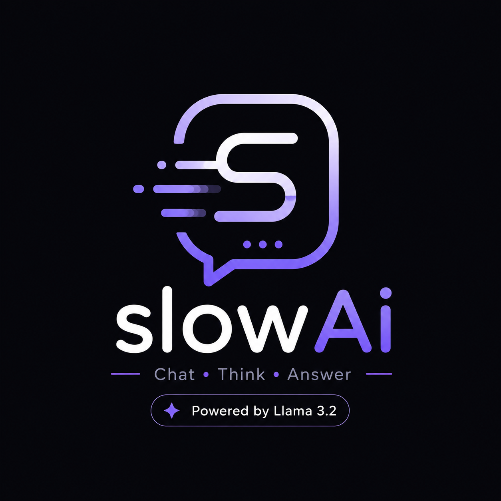
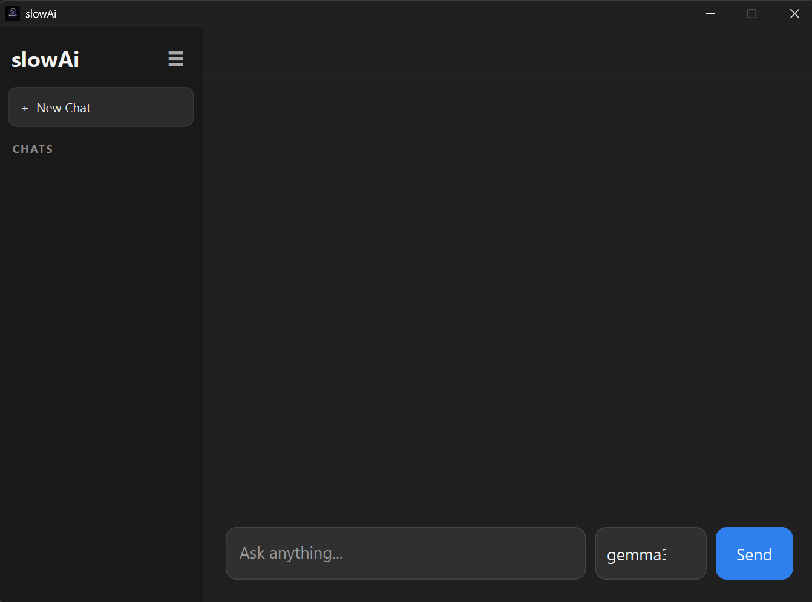
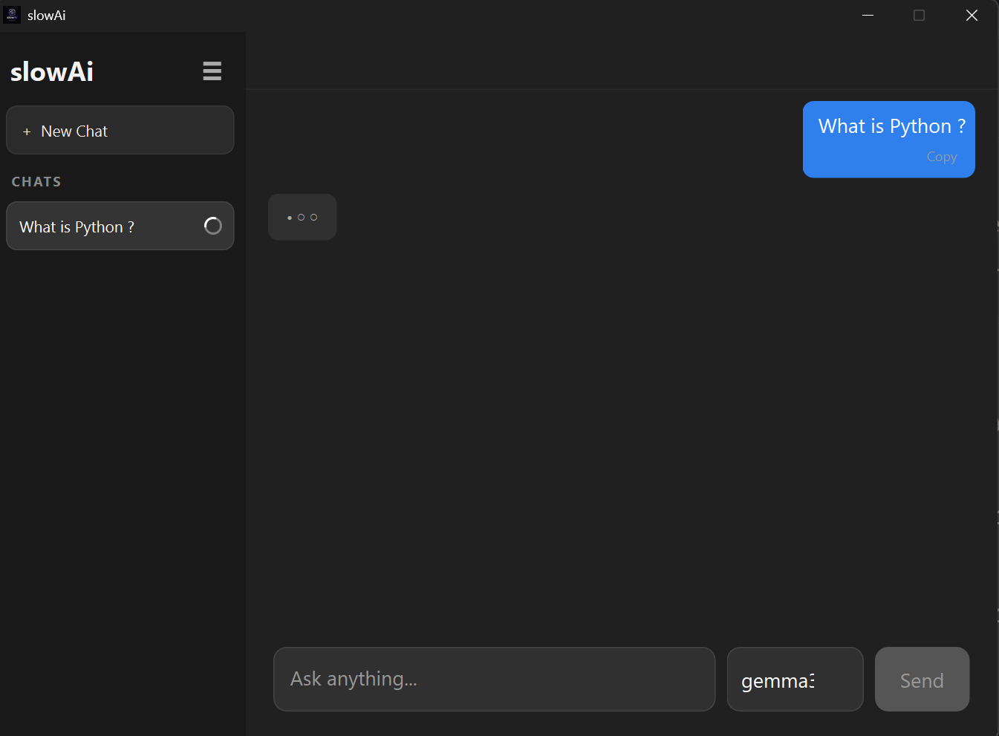
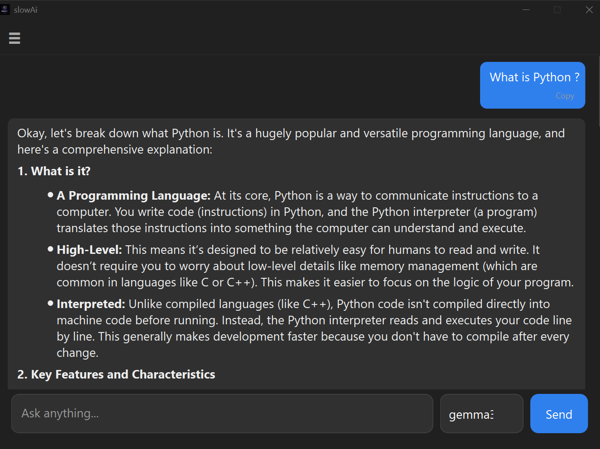
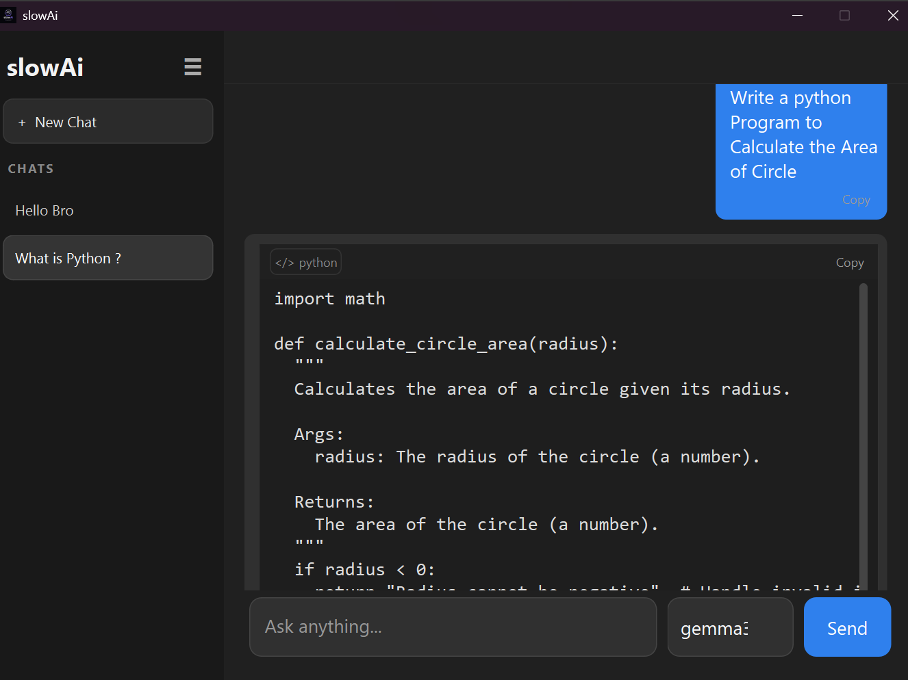

<h1>
  
  slowAi
</h1>

slowAi is a Python desktop application that lets you interact with locally running models through Ollama.

The application provides a desktop interface for sending messages to an Ollama model, receiving responses as they are generated, and keeping conversations locally.

The project was built as a learning project to explore Python desktop development, PySide6, local AI APIs, streaming responses, threading, and SQLite.

> **Note:** slowAi does not contain or train an LLM. The model is provided and run separately by Ollama.

## Features

* Connects to Ollama running locally
* Automatically loads available Ollama models
* Select which installed model to use
* Send messages to the selected model
* Receive responses as a stream
* Multiple conversations
* Local conversation history
* SQLite database for storing chats
* Create new chats
* Delete chats
* Automatically names a new chat from the first message
* Markdown rendering for model responses
* Tables, lists, headings, links, and other Markdown elements
* Separate display for fenced code blocks
* Copy messages
* Copy code blocks
* Loading animation while a response is being generated
* Sidebar with conversation history
* Collapse and expand the sidebar
* Chat-specific loading indicators
* Background Ollama requests using `QThread`
* Automatic scrolling while a response is being generated
* Keeps the user's scroll position when they scroll through a response

## How It Works

slowAi does not run the language model itself.

The application communicates with Ollama through its local HTTP API.

The basic flow is:

```text
User
  ↓
slowAi
  ↓
Ollama HTTP API
  ↓
Local Ollama Model
  ↓
Streaming Response
  ↓
slowAi
  ↓
Displayed Response
```

When a message is sent, `Chat.py` creates an `OllamaWorker` that sends the conversation to Ollama.

The response is received in chunks and passed back to the application using Qt signals.

The completed conversation is then stored locally using `ChatDB` from `Database.py`.

## Technologies Used

### Python

The main programming language used for the application.

### PySide6

Used to build the desktop application interface and handle Qt functionality such as:

* Windows and widgets
* Layouts
* Signals and slots
* Threads
* Timers
* Animations
* Scroll areas

### Ollama

Used as the local runtime for the language models.

slowAi communicates with Ollama through its HTTP API.

### Requests

Used to make HTTP requests to the local Ollama API.

### SQLite

Used to store conversations locally.

### Markdown

Used to convert model Markdown responses into HTML for display inside the application.

## Project Files

The current project is intentionally small and consists mainly of two Python files:

```text
slowAi/
│
├── Chat.py
├── Database.py
│
├── icon/
│   └── icons.ico
│
├── README.md
├── requirements.md
└── .gitignore
```

### `Chat.py`

Contains the main application and UI.

It includes:

* `MainWindow`
* `OllamaWorker`
* `ChatButton`
* `CircularLoader`
* `CopyButton`
* `CodeBlock`
* `AIContent`

It also handles:

* Ollama communication
* Streaming responses
* Chat management
* UI updates
* Model selection
* Sidebar behavior
* Loading indicators
* Markdown rendering
* Copy functionality
* Application startup and shutdown

### `Database.py`

Contains the `ChatDB` class responsible for local chat storage.

It handles:

* Creating the SQLite database
* Creating the `chats` table
* Creating chats
* Updating messages
* Updating chat names
* Reading chats
* Deleting chats
* Checking whether a chat exists
* Migrating older versions of the database

The database stores the conversation messages as JSON inside SQLite.

## Requirements

* Python 3.10 or newer
* Ollama
* At least one Ollama model

## Ollama Setup

Install Ollama from it's official Website separately and make sure it is running.

Open CMD Then install a model.

For example:

```bash
ollama pull llama3.2
```

You can check the models installed on your system with:

```bash
ollama list
```

slowAi communicates with Ollama through:

```text
http://localhost:11434
```

The Ollama models are **not included with this project**.
> **Note:** Response speed depends on the user's system and the Ollama model being used. Factors such as CPU, GPU, RAM, and model size can affect how quickly responses are generated.

## Running the Application

Clone the repository and enter the project directory:

```bash
git clone https://github.com/MickyMaikash/slowAi.git
cd slowAi
```

Create a virtual environment:

```bash
python -m venv venv
```

Activate the virtual environment:

**Windows:**

```bash
venv\Scripts\activate
```

Install the dependencies:

```bash
pip install -r requirements.txt
```

Make sure Ollama is running, then start the application:

```bash
python Chat.py
```

## Local Data

Chat history is stored in a local SQLite database.

The application stores its SQLite database in the user's local application data directory:

```text
%LOCALAPPDATA%\slowAi\chat.db
```

The database is created automatically when the application starts.

If `chat.db` is deleted, all saved conversations stored in it will be lost. A new empty database will be created automatically the next time slowAi starts.

SQLite may also create `chat.db-wal` and `chat.db-shm` files in the same directory while the application is running. These are normal SQLite files and are created automatically when needed.

## Building a Windows Executable

The application can be packaged using PyInstaller.

Install PyInstaller:

```bash
pip install pyinstaller
```

Then run:

```bash
pyinstaller --noconfirm --clean --onefile --windowed --name "slowAi" --icon "icon/icons.ico" --add-data "icon;icon" Chat.py
```

The executable will be created at:

```text
dist/slowAi.exe
```

The packaged application still requires Ollama to be installed and running on the computer.

The Ollama model is also not bundled into the executable.

## Why I Built This

This project was mainly built to learn how a Python desktop application can communicate with a locally running AI service.

Some of the things explored while building it include:

* Building a desktop UI with PySide6
* Working with Qt signals and slots
* Running network requests in background threads
* Processing streaming HTTP responses
* Communicating with a local API
* Working with SQLite
* Storing structured data as JSON
* Rendering Markdown
* Creating custom Qt widgets
* Building UI animations
* Managing multiple active requests
* Packaging a Python application with PyInstaller

## AI Assistance

This project was developed with the help of AI, including ChatGPT.

AI assistance was used throughout the development process for UI development, understanding concepts, debugging, code suggestions, and implementation guidance.


## Current State

slowAi is a personal learning project.

The application is functional, but the codebase is still relatively small and currently keeps most of the application inside `Chat.py`.

There are areas that could be improved as the project develops, particularly around separating the UI, Ollama communication, and database-related code into separate modules.

The goal of the project is not to present a new AI model or a replacement for an existing AI service. It is a desktop application built around Ollama for learning and experimentation.

## Possible Improvements

Some things I may work on later:

* Better project structure
* Stop/cancel response generation
* Chat renaming from the UI
* Search through conversations
* Application settings
* Better error handling
* More control over Ollama requests
* Improved Markdown/code rendering
* More UI customization
* Tests for database functionality
* Further separation of application components

## Screenshots








